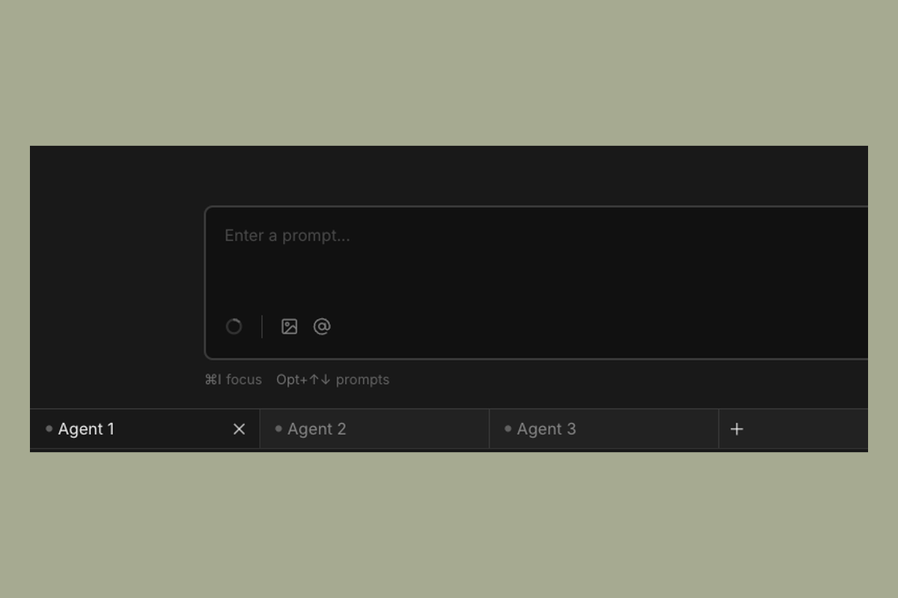

# Agents

Each agent in Sculptor has its own conversation, task context, and set of pending changes. Within a single workspace, you can run multiple agents at the same time.

---

## Opening multiple agents

The agent tab bar runs along the bottom of the Sculptor window. Each tab is a separate agent session.

- Click **+ Agent** to open a new agent in the current workspace
- Click any tab to switch between agents
- Each agent maintains its own conversation history independently

All agents in a workspace share the same cloned repository. This means one agent can build a feature while another writes tests for it, and they're both operating on the same files.

---

## When to use multiple agents

Running multiple agents in parallel is useful when the work can be cleanly divided. Some examples:

- One agent implements a feature, another writes tests for it
- One agent handles the backend changes, another updates the frontend
- One agent does a refactor, another reviews the diff and suggests fixes

The tradeoff is coordination: if two agents edit the same file simultaneously, they can produce conflicting changes. Structure your tasks so agents are working in different parts of the codebase, or stagger them so one finishes before the other starts on dependent files.
