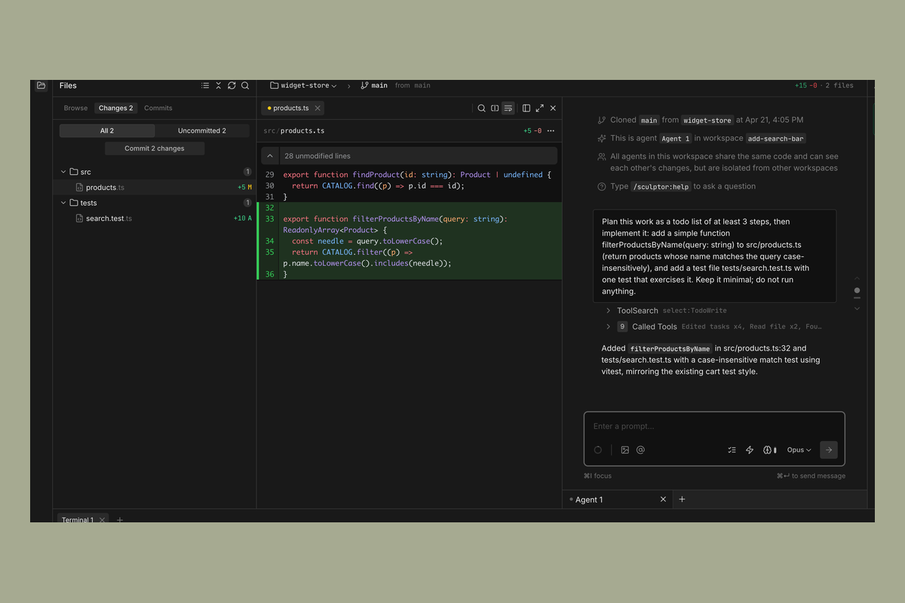
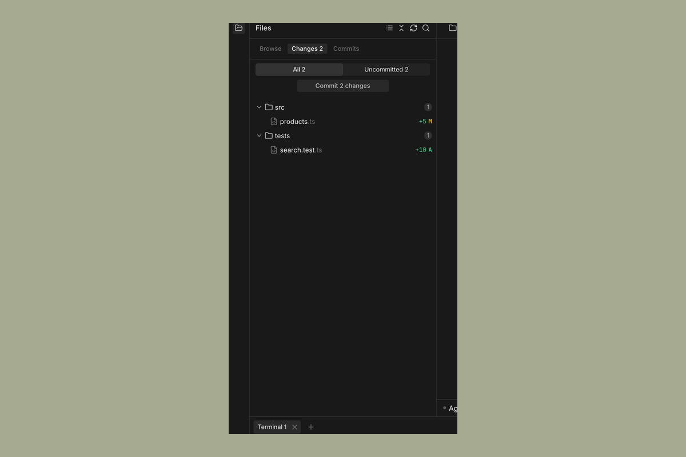

# Changes

When an agent makes changes, you can inspect them in the **Files** panel before deciding what to do with them. Nothing is committed until you explicitly commit.

---

## The Files panel

The Files panel is open by default in the top-left of the Sculptor window. It has three tabs:

- **Browse** — the repo's file tree, for opening and inspecting any file
- **Changes** — every uncommitted file the agent has modified in the current workspace
- **Commits** — the commit history on the workspace branch

When there are uncommitted changes, the Changes tab label shows the count — e.g. **Changes 2**. Click the tab to see the list, then click any file in the list to open its diff in the main panel.

You can click between files to see each diff, and the view shows the specific lines added or removed with the usual green/red highlighting.

---

## Reviewing changes

The Changes tab shows the cumulative uncommitted diff for the workspace — the sum of everything the agent has done since the last commit, not just the last message.

If something looks wrong, send a follow-up message in the chat panel to ask the agent to revise. The diff will update as the agent makes corrections.

---

## Committing changes

When you're satisfied with the changes, click the **Commit** button at the bottom of the Changes tab. The button label reflects the change count — for example, **Commit 2 changes**.

Sculptor asks the agent to write a commit message and run the commit on your workspace branch. Committing does not push to your remote repository — the commit lives locally in the workspace clone until you push it yourself.

To customize the commit prompt, right-click the **Commit** button and pick **Edit prompt…**.

---

## Discarding changes

In the Changes tab, each modified file has a **Discard changes** action on its row that reverts just that file to its last committed state. There's no single "discard all" button; to reset the workspace, discard files individually (or ask the agent to revert them).
