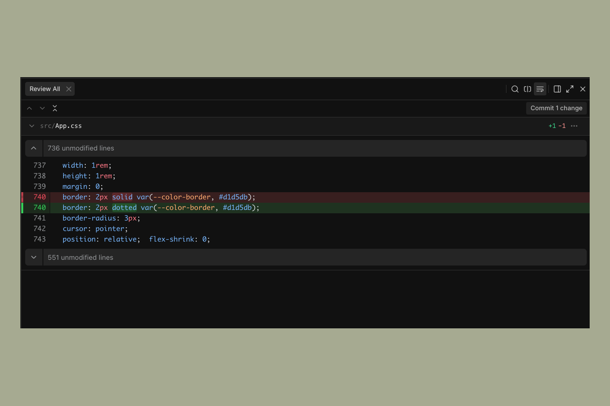
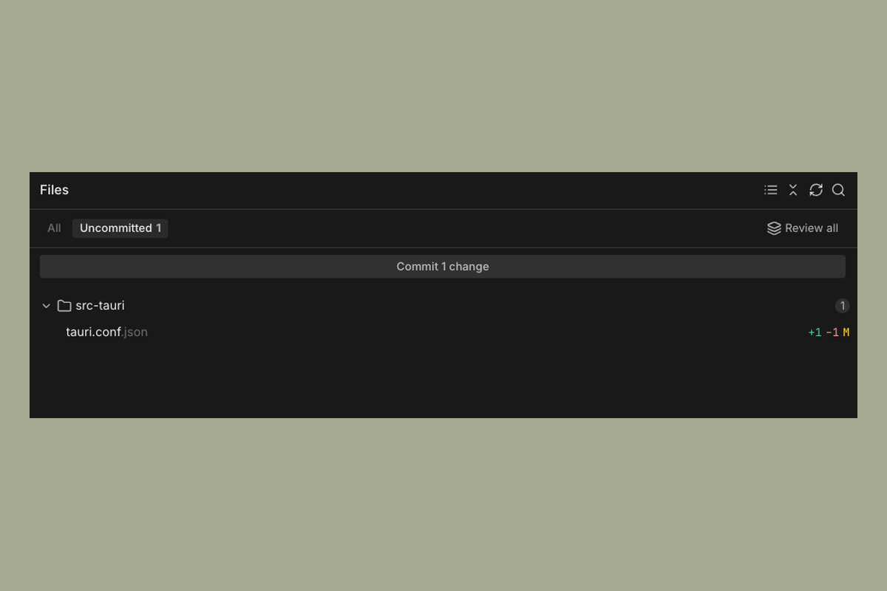

# Code Review

When an agent makes changes, you can inspect them in the **code review panel** before deciding what to do with them. Nothing gets merged into your workspace clone until you explicitly say so.

---

## Opening the code review panel

Click the code review icon in the right side of the Sculptor toolbar to open the panel. It shows all file changes the agent has made in the current session, as a diff.

You can scroll through changed files, expand and collapse individual diffs, and read through the specific lines added or removed.

---

## Reviewing changes

The panel shows the cumulative diff of everything the agent has done, not just the last message. If the agent made changes across multiple steps or files, they all appear here.

If something looks wrong, you can send a follow-up message in the chat panel to ask the agent to revise. The diff will update as the agent makes corrections.

---

## Merging changes

When you're satisfied with the changes, click Merge in the code review panel. This applies the agent's changes to the local workspace clone.

Merging does not push to your remote repository.

---

## Discarding changes

If you want to start over, you can discard the agent's changes from the code review panel without merging. This resets the workspace clone back to its previous state.
