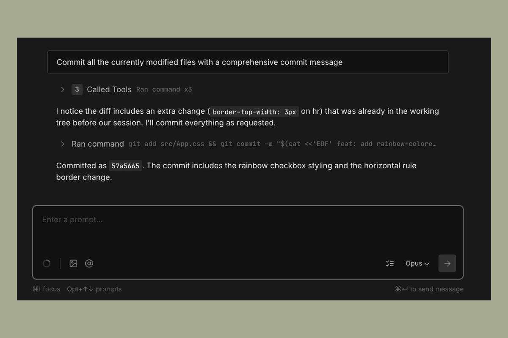
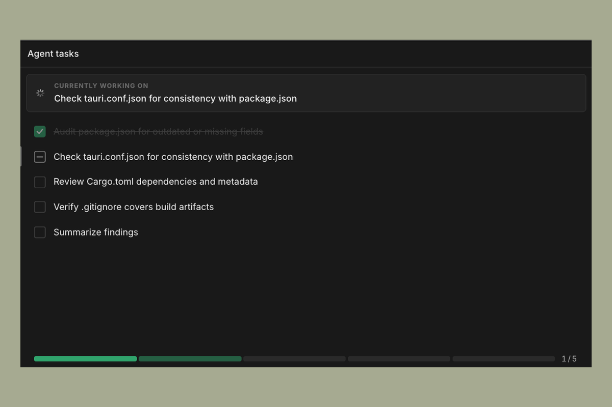
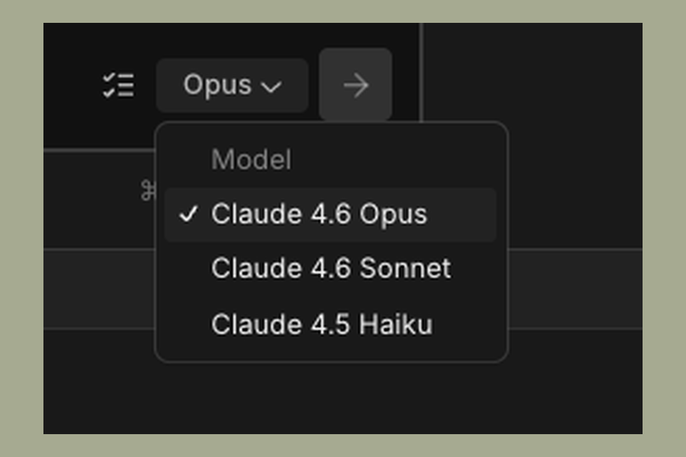
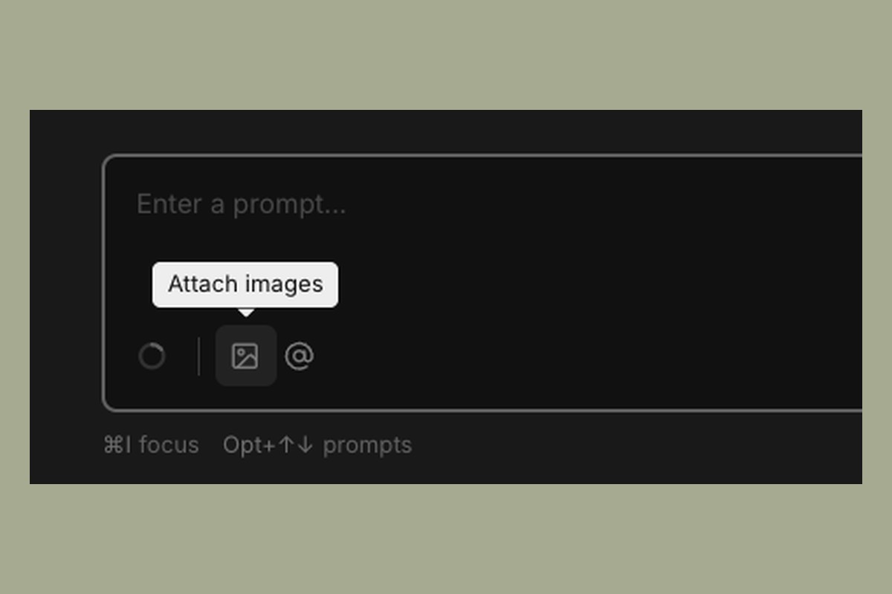
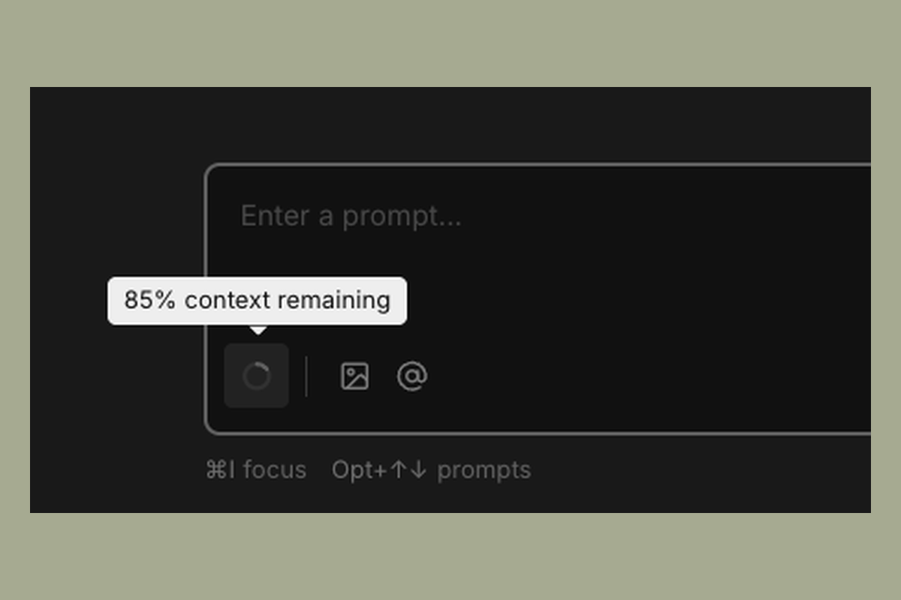
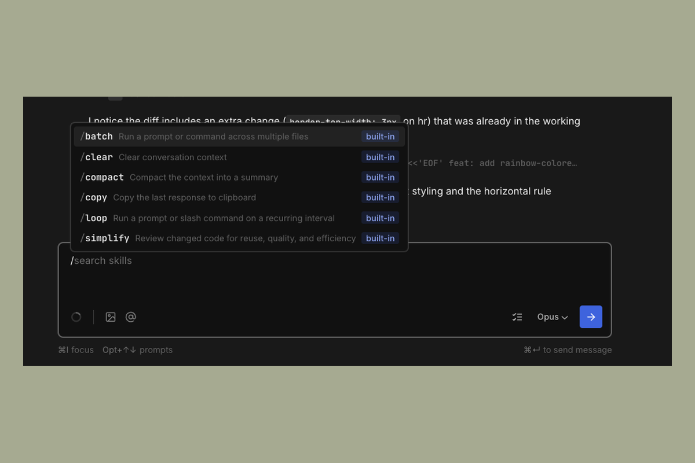

# Interface

This page covers the main UI elements in Sculptor and how to use them.

---

## Chat panel

The main panel is where you direct the agent. Type your task in the input box at the bottom and send it. The agent's responses, tool calls, and progress appear in the panel above.

---

## Agent Tasks panel

For complex tasks, the agent breaks the work down into discrete steps. These steps are visible in the **Agent Tasks** panel in the top right of the Sculptor window.

Each entry in the panel represents one unit of work the agent has planned or is actively executing. You can use this to track progress on longer tasks without needing to follow every message in the chat panel.

If the agent goes off track, you can send a correction message in the chat panel to redirect it. The task list will update to reflect the new plan.

---

## Model picker

The model picker sits at the top of the chat input area. Click it to switch the model for the current agent session. The change takes effect on the next message you send.

---

## Attaching context

**Images** — You can attach images directly to your message using the attachment button in the input bar. This is useful for pasting screenshots of UI bugs, error dialogs, or design references.

**@ file mentions** — Type `@` followed by a filename to reference a specific file in your repo. The agent will load that file into its context. This is useful when you want to point the agent at a specific module without relying on it to find the right file on its own.

---

## Context window indicator

Hover over the context window icon in the chat toolbar to see how much of the model's context window has been used in the current session.

---

## Slash commands

Type `/` in the input box to open a list of available commands and skills. These include built-in session commands like `/clear` and `/compact`, as well as more powerful skills like `/batch` and `/simplify`. See [Slash Commands](slash-commands.md) for the full reference.

---

## Terminal

Click the terminal icon at the bottom of the Sculptor window to open a terminal session. The terminal runs in the context of the current workspace clone, so any commands you run operate on the same files the agent is working with.

This is useful for:

- Starting a dev server to test the agent's changes
- Running tests or linters directly
- Inspecting git state (`git log`, `git diff`, etc.)
- Any CLI operation that's easier to run yourself than to ask the agent to do

You can have the terminal open alongside an active agent session. They don't interfere with each other.

