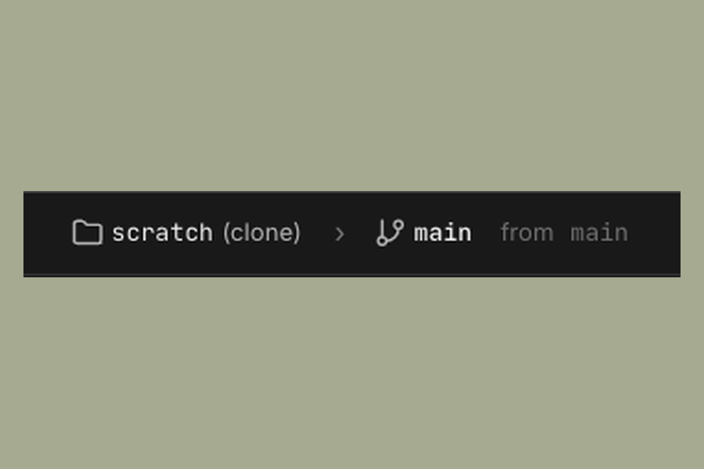

# Workspaces

A workspace is a project environment in Sculptor. Each workspace is tied to one repository. When you create a workspace, Sculptor clones that repo locally and runs all agents against the clone.

---

## How workspaces map to repos

When you create a workspace, Sculptor:

1. Clones the target repository into `.sculptor_data/workspaces/<workspace-name>/`
2. Checks out the default branch
3. Runs all agents in that cloned environment

This means your original repo is never touched directly. Changes the agent makes live in the workspace clone until you explicitly merge them.

The workspace path is visible in the top bar of the Sculptor UI:

For example, if you created a workspace for a repo called `api-server` on the `main` branch, you'd see `api-server (clone) > main`.

---

## Creating a workspace

Click the **+** tab at the top of the Sculptor window to create a new workspace. You'll be prompted to provide the repository URL or path. Sculptor will clone it and set up the environment.

Each workspace tab is independent, so switching between tabs switches between different repos and their agent sessions.

---

## Multiple workspaces

You can have multiple workspaces open at once, one per tab. Each workspace maintains its own:

- Cloned repository state
- Active agents and their conversation histories
- Pending code changes

There's no shared state between workspaces.

---

## Where the data lives

Sculptor stores workspace data under `.sculptor_data/workspaces/` in your home directory (or a configured root). Each workspace is a self-contained directory with the repo clone and any Sculptor metadata.

You can open a terminal inside Sculptor (see [Interface](interface.md)) to inspect or interact with the workspace clone directly.
